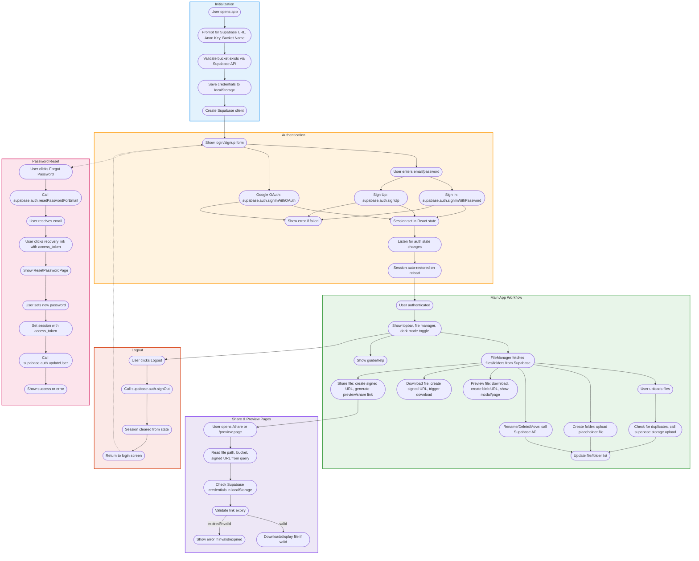

# FileStashify

> **See the full workflow and architecture:** [WORKFLOW.md](./WORKFLOW.md)

## Visual Workflow Diagram



[](LICENSE)  

A modern cloud storage frontend using Supabase Storage.

---

## Table of Contents

- [About](#about)
- [Features](#features)
- [Demo](#demo)
- [Installation](#installation)
- [Supabase Setup Guide](#supabase-setup-guide)
- [Usage](#usage)
- [Technologies Used](#technologies-used)
- [Author](#author)
- [License](#license)

---

## About

FileStashify is a React-based frontend application that provides a seamless interface to manage your cloud files using Supabase Storage. It offers a user-friendly UI that reduces the complexity of storing and accessing files directly from Supabase, providing various functions for efficient file management. It supports user authentication, file and folder management, file sharing with expiring links, and file previews — all in a modern, intuitive UI.

---

## Features

- User sign up, sign in, and sign out
- Initialize connection with your Supabase project and storage bucket
- Create, upload, download, and delete files and folders
- Share files with expiring signed URLs
- Preview images, PDFs, and text files directly in the app
- Responsive and modern UI with modals for sharing, viewing, and error handling

---

## Demo

*Add screenshots or GIFs here to showcase the app UI and features.*

---

## Installation

1. Clone the repository:

   ```bash
   git clone https://github.com/yourusername/file-stashify.git
   cd filestashify
   ```

2. Install dependencies:

   ```bash
   npm install
   ```

3. Start the development server:

   ```bash
   npm start
   ```

4. Open your browser and navigate to `http://localhost:3000`.

---

## Supabase Setup Guide

1. Create a Supabase account at [https://supabase.com](https://supabase.com) and log in.
2. Create a new Supabase project with a name and database password.
3. Enable authentication in the Supabase dashboard:
   - Go to **Authentication** and enable email/password or OAuth providers.
4. Create a storage bucket:
   - Go to **Storage** and create a bucket (e.g., `user-files`).
   - Set bucket privacy as needed.
5. Set bucket access policies:
   - Go to the **Policies** tab under your storage bucket.
   - Use the **Other policies under storage.objects** option to add policies.
   - Example policy to allow authenticated users to upload files:
     ```sql
     (auth.role() = 'authenticated')
     ```
   - Add policies to allow users to read/download and delete their own files based on metadata or naming conventions.
6. Get API credentials:
   - Go to **Settings > API** in the Supabase dashboard.
   - Copy the **URL** and **anon public** API key.
7. Configure the app:
   - Enter the Supabase URL, anon key, and storage bucket name in the app's initialization screen.
   - Click **Initialize Supabase** to connect the app to your Supabase project.

---

## Usage

- Sign up or sign in using your email and password.
- Create folders, upload files, navigate folders, download files, and delete files or folders.
- Share files with expiring links using the share button.
- Preview supported file types directly in the app.

---

## Technologies Used

- [React](https://reactjs.org/) - Frontend UI library
- [Supabase](https://supabase.com/) - Backend as a service (authentication, storage)
- [JavaScript (ES6+)](https://developer.mozilla.org/en-US/docs/Web/JavaScript) - Programming language
- CSS for styling

---

## Author

Kartik Kumar Pandey

---

## License

This project is licensed under the MIT License - see the [LICENSE](LICENSE) file for details.
