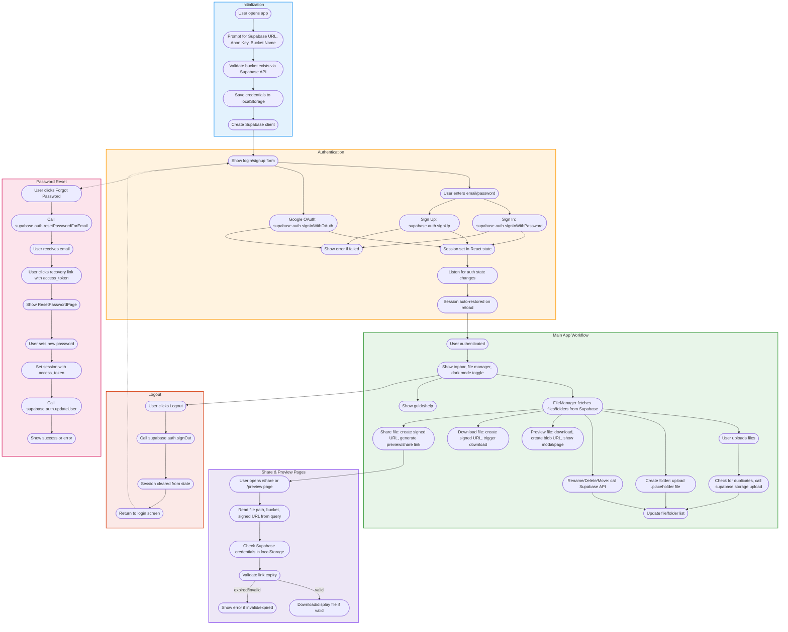

# FileStashify Workflow Documentation

## Visual Workflow Diagram

> The following flowchart illustrates the complete FileStashify workflow. (If you are viewing this in a Markdown viewer that supports Mermaid, the diagram will render automatically.)

> **PNG/SVG Export:** See the exported SVG/PNG files in the project root for use in presentations or documentation that does not support Mermaid.

This document describes the detailed workflow and actions of the FileStashify app, covering user interactions, authentication, file management, sharing, password reset, dark mode, and initialization. It is intended for developers to understand the full flow of the application.

---

## 1. **Initialization**
- **First Launch:**
  - User is prompted to enter Supabase URL, Anon Key, and Bucket Name.
  - On submission, these values are saved to `localStorage` and used to initialize the Supabase client.
  - The app then attempts to connect to Supabase and proceeds to authentication.

---

## 2. **Authentication**
- **Sign In:**
  - User enters email and password.
  - On clicking 'Sign In', the app calls `supabase.auth.signInWithPassword`.
  - If successful, a session is created and the user is logged in.
  - If failed, an error message is shown.
- **Sign Up:**
  - User enters email and password and clicks 'Sign Up'.
  - The app calls `supabase.auth.signUp`.
  - If successful, a confirmation email is sent to the user.
  - User must confirm via email before logging in.
- **Google OAuth:**
  - User clicks 'Sign in with Google'.
  - The app calls `supabase.auth.signInWithOAuth({ provider: 'google' })`.
  - User is redirected to Google for authentication, then back to the app.
- **Session Management:**
  - The app listens for auth state changes and updates the session accordingly.
  - On logout, `supabase.auth.signOut()` is called and the session is cleared.

---

## 3. **Password Reset**
- **Forgot Password:**
  - User clicks 'Forgot Password?'.
  - The app calls `supabase.auth.resetPasswordForEmail(email)`.
  - Supabase sends a password reset email to the user.
- **Password Recovery:**
  - User clicks the link in the email, which opens the app with a special URL (`type=recovery&access_token=...`).
  - The app detects this and shows the `ResetPasswordPage`.
  - User sets a new password, which is updated via Supabase.

---

## 4. **Main App Workflow (After Login)**
- **Topbar:**
  - Shows app title, dark mode toggle, user email, and logout button.
- **Dark Mode:**
  - User can toggle dark/light mode.
  - The mode is saved in `localStorage` and applied via CSS classes.
- **File Manager:**
  - **List Files/Folders:**
    - The app fetches the list of files/folders from the Supabase bucket.
    - Files and folders are displayed in a grid/list.
  - **Upload Files:**
    - User clicks upload and selects files.
    - Files are uploaded to the Supabase bucket using the Supabase storage API.
    - Progress is shown during upload.
  - **Create Folder:**
    - User can create a new folder, which is created in the Supabase bucket.
  - **Rename/Delete/Move:**
    - User can rename, delete, or move files/folders.
    - These actions call the appropriate Supabase storage API methods.
  - **Preview Files:**
    - User can preview supported file types (e.g., images, PDFs) in a modal or new page.
  - **Share Files:**
    - User can generate a shareable link for a file.
    - The app creates a signed URL using Supabase and displays it to the user.
  - **Guide Button:**
    - A help/guide button is available for user assistance.

---

## 5. **Special Pages**
- **/share:**
  - Displays a public file sharing page for a file with a valid signed URL.
- **/preview:**
  - Displays a preview of a file (for supported types).

---

## 6. **State Management**
- **Supabase Client:**
  - Initialized once with credentials from `localStorage`.
- **Session:**
  - Managed via Supabase auth listeners and React state.
- **Dark Mode:**
  - Managed via React state and `localStorage`.
- **User Email:**
  - Updated after login and shown in the topbar.

---

## 7. **Error Handling**
- All API calls (auth, storage) are wrapped with error handling.
- Errors are displayed to the user in the UI.

---

## 8. **Logout**
- User clicks 'Logout'.
- The app calls `supabase.auth.signOut()` and clears the session.
- User is returned to the login screen.

---

## 9. **Persistent Settings**
- Supabase credentials and dark mode preference are stored in `localStorage` for persistence across sessions.

---

## 10. **Responsive Design**
- The app uses CSS media queries to ensure usability on both desktop and mobile devices.

---

## 11. **Security**
- All file operations use Supabase's secure storage API.
- Shared links are signed and expire after a set time (if configured).
- User authentication is handled securely via Supabase.

---

## 12. **Developer Notes**
- All main logic is in `src/App.js` and `src/components/`.
- Supabase client is configured in `src/supabaseClient.js`.
- Styles are in `src/App.css`.
- For new features, follow the existing component and state management patterns. 